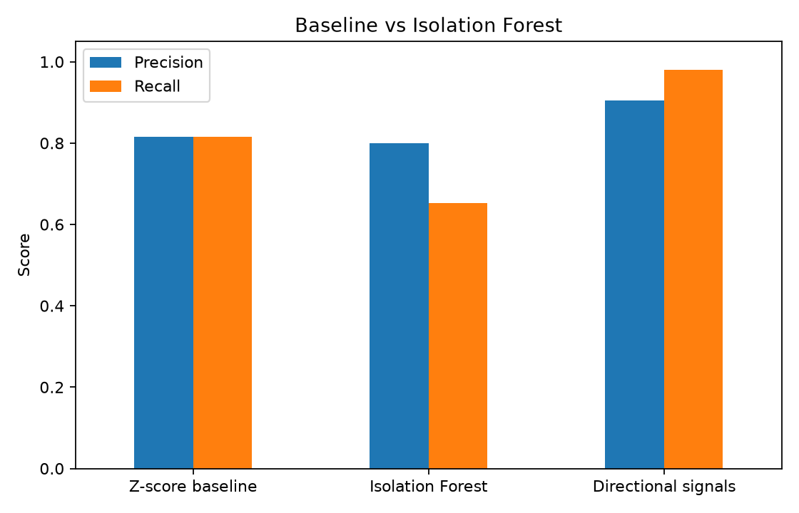
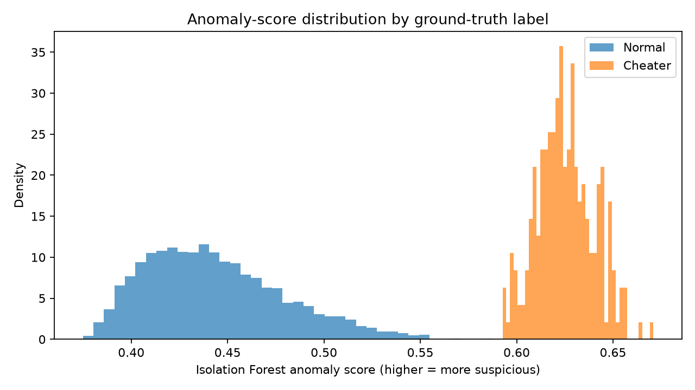
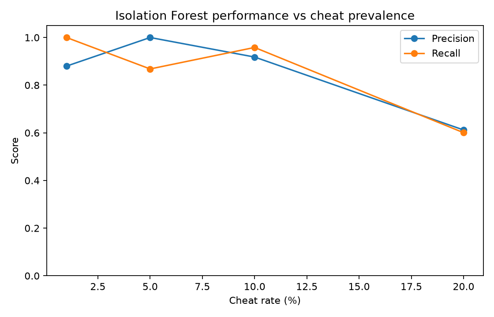

# Anti-Cheat

A backend portfolio project that ingests simulated game data, detects suspicious sessions, and exposes a cached trust score. It progresses from a transparent statistical baseline to an async, ML-backed service.

## Architecture

```text
Game client -> FastAPI POST /events -> Redis/Celery queue -> Celery scorer
                                                        -> Isolation Forest
                                                        -> Redis trust_score:{session_id}
Game client <- FastAPI GET /trust_score/{session_id} <- Redis cache
```

FastAPI validates and accepts data quickly. It does **not** run model inference during the request: scoring happens in Celery asynchronously so bursts do not exhaust web workers, worker capacity can scale independently, and Redis failures can retry safely. Redis is the Celery broker and the short-lived lookup cache; those are separate uses of the same service.

## Setup

This project targets Python 3.11. Docker is the simplest reproducible path:

```bash
docker compose build
docker compose run --rm api python generate_data.py
docker compose run --rm api python baseline_detector.py
docker compose run --rm api python ml_detector.py
docker compose up --build
```

The model must be generated before starting the worker because it loads `models/isolation_forest.joblib` on its first scoring task. With the stack running in a second terminal:

```bash
docker compose run --rm api python load_test.py --url http://api:8000 --sessions 100 --rate 10
docker compose run --rm api python imbalance_experiment.py
```

For a non-Docker installation, create a Python 3.11 virtual environment and run `pip install -r requirements.txt` first.

## Phases

<<<<<<< HEAD
1. `generate_data.py` creates 5,000 session-level records in `sessions.csv`: typical legitimate players, elite legitimate players (10% of legitimate sessions), and deliberately inhuman bot/cheat sessions (5% overall). Elite players are fast and accurate but retain human reaction-time variation, irregular click timing, and plausible movement caps. Both legitimate profiles use label 0; labels are never used to train the ML detector.
2. `baseline_detector.py` uses RMS combined z-scores. This transparent baseline reports precision, recall, F1, false-positive rate, a confusion matrix, and mistakes to show what thresholding misses.
3. `ml_detector.py` uses a reproducible 60/20/20 train/validation/test split. It fits an Isolation Forest only on training features, chooses thresholds on validation data using a declared false-positive-rate budget, and reports final metrics only on the untouched test set. It also reports false-positive rates for typical and elite legitimate players, then saves the model and creates the first two graphs below.
=======
1. `generate_data.py` creates 5,000 session-level records in `sessions.csv`: average players, very skilled players (10% of legitimate sessions), and deliberately inhuman bot/cheat sessions (5% overall). The skilled players are fast and accurate but retain human reaction-time variation, irregular click timing, and plausible movement caps. Both legitimate profiles use label 0; labels are never used to train the ML detector.
2. `baseline_detector.py` uses RMS combined z-scores. This baseline reports precision, recall, F1, false-positive rate, a confusion matrix, and mistakes to show what thresholding misses.
3. `ml_detector.py` fits an Isolation Forest only on the seven telemetry features. Isolation Forest is appropriate where confirmed-cheat labels are limited: it isolates rare behavioral patterns without supervised training. It reports false-positive rates for typical and elite legitimate players, then saves the model and creates the first two graphs below.
>>>>>>> 2e9540c43ebafcf4bc9381b1fa77364a8d1c9874
4. `app.py` accepts raw streams; `tasks.py` extracts the same seven features via `telemetry.py`, scores them asynchronously, and caches the score. Centralizing feature extraction avoids training-serving skew.
5. `load_test.py` makes Phase 1-like raw events and reports end-to-end POST-to-Redis latency. `imbalance_experiment.py` regenerates data at 1%, 5%, 10%, and 20% cheat rates, then measures unsupervised performance.
6. This README records the architecture, how to reproduce each phase, evaluation output, and the generated evidence below.

## API example

```bash
curl -X POST http://localhost:8000/events -H "Content-Type: application/json" -d '{
  "session_id":"match-123-player-7",
  "reaction_times_ms":[225,245,271],
  "movement_speeds":[4.8,5.2,6.0],
  "click_timestamps_ms":[0,205,430,660],
  "aim_movements":[false,false,true,false]
}'
curl http://localhost:8000/trust_score/match-123-player-7
```

`POST /events` returns HTTP 202 and a task ID. `GET /trust_score/{session_id}` returns 404 while the task is waiting or unknown, then returns a bounded `trust_score` (a display value, not a cheating probability), raw anomaly score, and extracted features.

## Generated evaluation graphs

Run the commands above to create these repository-local PNGs:

| Graph | Script |
| --- | --- |
| `graphs/baseline_vs_ml.png` | `ml_detector.py` |
| `graphs/anomaly_score_distribution.png` | `ml_detector.py` |
| `graphs/precision_recall_vs_cheat_rate.png` | `imbalance_experiment.py` |
| `graphs/held_out_evaluation.json` | `ml_detector.py` |

### Baseline vs ML precision/recall



### Isolation Forest anomaly-score distribution



### Precision and recall by cheat rate



## Limitations

The data is simulated, meaning that it does not perfectly follow real behavior. Real cheaters are more varied and less obvious, while legitimate players differ by device, accessibility needs, connection quality, skill level, and game mode. A production service would need privacy controls, calibrated thresholds, review workflows, drift monitoring, and carefully evaluated appeals, not automatic decisions from this score alone.
